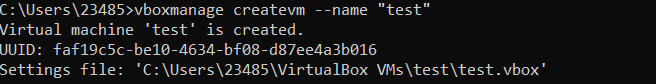

## PART 1. HYPERVISORS

#### What are the most popular hypervisors for infrastructure virtualization?
- Oracle VirtualBox
- Microsoft Hyper-V
- VMware ESXi/vSphere
- Xen / Citrix XenServer

#### Briefly describe the main differences of the most popular hypervisors.
There are two types of hypervisors. The first type runs directly on the host's hardware. Another runs in a window as a typical computer application.
  
## PART 2. WORK WITH VIRTUALBOX

### First run VirtualBox and Virtual Machine

**Created a virtual machine VM1_Ubuntu_Ratinskiy and made a clone of it called VM2_Ubuntu_Ratinskiy**

  
**Created a group of these two VMs**

  
**Formed a branched tree of snapshots for VM1_Ubuntu_Ratinskiy**

  
**Exported VM1_Ubuntu_Ratinskiy as a file and imported it again**

  

### Configuration of virtual machines

**Configured a USB connection to the VM**

  
**Created a shared folder between VM1 and the host**

  
**Made a table of possible connections (between VM1, VM2, Host, Internet) using different network modes**
| Mode        | VM to Host | Host to VM   | VM1 to VM2   | VM to Net/LAN | Net/LAN to VM |
| ----------- | -----------| -------------| -------------| --------------| --------------|
| Host-only   | Yes        | Yes          | Yes          | No            | No            |
| Internal    | No         | No           | Yes          | No            | No            |
| Bridged     | Yes        | Yes          | Yes          | Yes           | Yes           |
| NAT         | Yes        | Port forward | No           | Yes           | Port forward  |
| NAT Network | Yes        | Port forward | Yes          | Yes           | Port forward  |
  

### Work with CLI through VBoxManage

VBoxManage list

  
VBoxManage showvminfo

  
VBoxManage startvm

  
VBoxManage createvm

  
VBoxManage modifyvm

  
VBoxManage clonevm

  
VBoxManage snapshot

  
VBoxManage controlvm

  

## PART 3. WORK WITH VAGRANT

vagrant init hashicorp/precise64
vagrant up

  
mobaxterm date

  
vagrant ssh-config
vagrant halt
vagrant destroy

  
create Vagrant box

  
My Vagrant box:
[test_box](https://app.vagrantup.com/olehratinskiy/boxes/test_box)