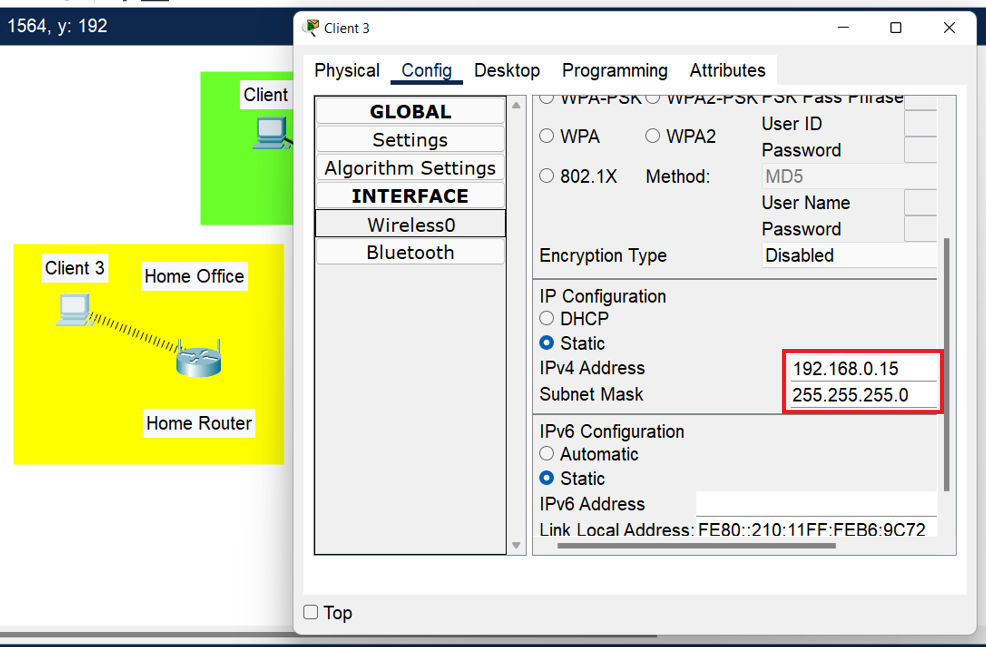

## Creating networks Home Office, Enterprise, Data Center

### 1. Assigned static IP addresses to all Enterprise devices
Client 1 - 10.3.5.10 \
 \
\
Client 2 - 10.3.5.20 \
 \
\
Client 3 - 10.3.5.100 \

### 2. Checked connection using <ins>ping</ins> command
From Client 1 \
 \
\
From Client 2 \
 \
\
From Client 3 \
 

### 3. Assigned static IP addresses to all Data Center devices
Web Server 1 - 6.5.3.50 \
 \
\
Web Server 2 - 6.5.3.100 \
 \
\
DNS Server - 6.5.3.150 \

### 4. Checked connection using <ins>ping</ins> command
From Web Server 1 \
 \
\
From Web Server 2 \
 \
\
From DNS Server \

### 5. Changed Ethernet adapter for Wi-Fi adapter PT-HOST-NM-1W

### 6. Assigned static IP address to Client 3
Client 3 - 192.168.0.15

### 7. Checked connection using <ins>ping</ins> command
